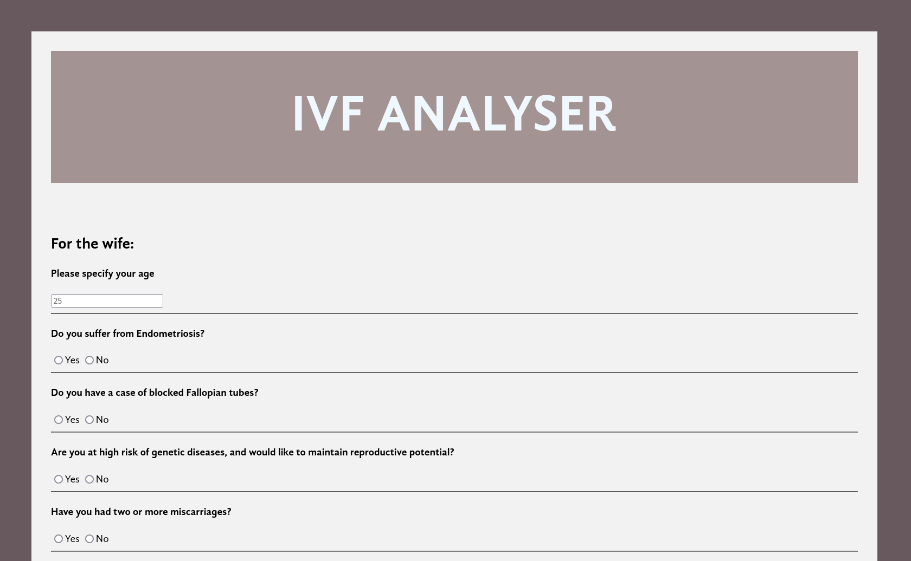

# IVF Analyser
#### This project was made as an entry for SOSC's Hacknight 2022. It won second place in Junior Level.

### There is an existing lack of organised information regarding IVF treatment for infertile couples. There is an imminent requirement for a reliable source confirming if any given couple with specific ailments require an IVF procedure.

### Our solution is a website that uses pesudo machine learning to determine wheter any given infertile couple would benefit from the IVF treatment. Being a website, it is readily accessible throughout the world. It acts as a first resort where physically meeting an expert is not an option.

---
#### Contributors:
- 
- 
- 
- 
